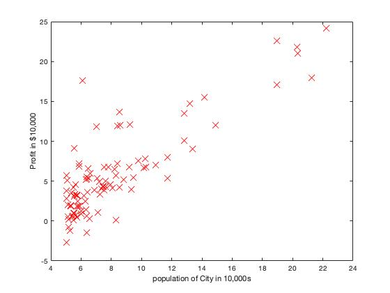

# Machine Learning (MATLAB)

Machine Learning course from Stanford on Coursera.

## Linear Regression 

### Environment
- macOS Catalina (version 10.15.3)
- MATLAB 2018 b

### ==================== Part 1: Basic Function ====================
### warmUpExercise.m : Simple example function in MATLAB

```
function A = warmUpExercise()

# Return the 5x5 identity matrix 
A = eye(5);

end
```

### ======================= Part 2: Plotting =======================
### plotData.m : Function to display the dataset

```
function plotData(x, y)
figure;
plot(x,y,'rx', 'MarkerSize', 10);
xlabel("population of City in 10,000s");
ylabel("Profit in $10,000");
end
```



### =================== Part 3: Cost and Gradient descent ===================
### computeCost.m : Function to compute the cost of linear regression
```

```

### gradientDescent.m : Function to run gradient descent
```

```

### ============= Part 4: Visualizing J(theta_0, theta_1) =============
###

```

```


## Course Links

1) Machine Learning by Stanford University on [Coursera](https://www.coursera.org/learn/machine-learning)

2) [Linear Regression](https://www.coursera.org/learn/machine-learning/programming/8f3qT/linear-regression) 
(Please notice that you need to log in to see the programming assignment.)