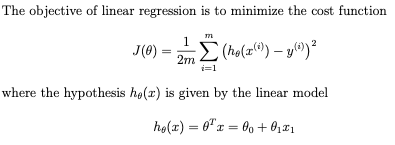
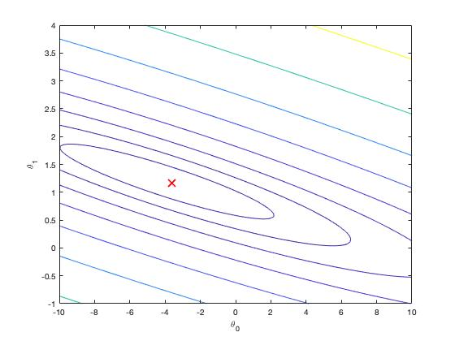
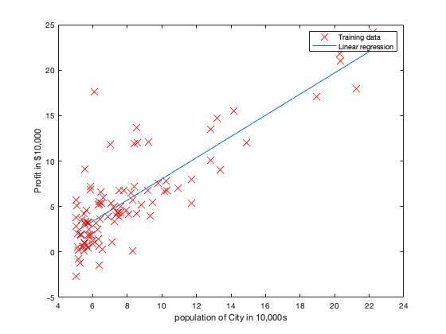
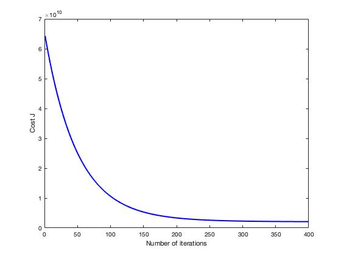
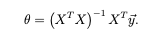

# Machine Learning (MATLAB)

Machine Learning course from Stanford University on Coursera.

### Environment
- macOS Catalina (version 10.15.3)
- MATLAB 2018 b

## Linear Regression 

### ==================== Part 1: Basic Function ====================
### warmUpExercise.m : Simple example function in MATLAB

```
function A = warmUpExercise()

# Return the 5x5 identity matrix 
A = eye(5);

end
```

### ===================== Part 2: Plotting =======================
### plotData.m : Function to display the dataset

```
function plotData(x, y)
figure;
plot(x,y,'rx', 'MarkerSize', 10);
xlabel("population of City in 10,000s");
ylabel("Profit in $10,000");
end
```


### =================== Part 3: Cost and Gradient descent ===================
In this part, we will fit the linear regression parameters θ to our dataset using gradient descent.



### computeCost.m : Function to compute the cost of linear regression
```
function J = computeCost(X, y, theta)

# Initialize some useful values
m = length(y); # number of training examples

# You need to return the following variables correctly 
J = 0;

# Compute the cost of a particular choice of theta. You should set J to the cost.
h = X * theta;
J = (1/(2 * m)) * sum((h-y).^2);
end
```

### gradientDescent.m : Function to run gradient descent
```
function [theta, J_history] = gradientDescent(X, y, theta, alpha, num_iters)

# Initialize some useful values
m = length(y); # number of training examples
J_history = zeros(num_iters, 1);

for iter = 1:num_iters
    
    h = X * theta;
    theta = theta - (alpha/m) * (X' * (h-y));
    
    % Save the cost J in every iteration    
    J_history(iter) = computeCost(X, y, theta);
end
end
```


Figure: Surface



Figure: Contour, showing minimum

### Result



Figure: Training data with Linear Regression Fit

## Multiple Linear Regression

In this part, we will implement linear regression with multiple variables to predict the prices of houses. Suppose we are selling our house and we want to know what a good market price would be. One way to do this is to first collect information on recent houses sold and make a model of housing prices.

The file 'ex1data2.txt' contains a training set of housing prices in Portland, Oregon. The first column is the size of the house (in square feet), the second column is the number of bedrooms, and the third column is the price of the house.

### =================== Part 4: Feature Normalization ===================
### featureNormalize.m

```
function [X_norm, mu, sigma] = featureNormalize(X)

# Need to set these values correctly
X_norm = X;
mu = zeros(1, size(X, 2));
sigma = zeros(1, size(X, 2));

mu = mean(X);
sigma = std(X);
X_norm = (X - mu)./sigma;
end
```

### ======= Part 5: Cost and Gradient descent with multiple variable ============

### computeCostMutli.m : Compute cost for linear regression with multiple variables

```
function J = computeCostMulti(X, y, theta)

% Initialize some useful values
m = length(y); % number of training examples

J = 0;
# Compute the cost of a particular choice of theta
h = X * theta;
J = (1/(2 * m)) * (sum((h-y).^2));

end
```

### gradientDescentMulti.m : Performs gradient descent to learn theta

```
function [theta, J_history] = gradientDescentMulti(X, y, theta, alpha, num_iters)

% Initialize some useful values
m = length(y); % number of training examples
J_history = zeros(num_iters, 1);

for iter = 1:num_iters

    h = X * theta;
    error = (h - y);
    theta = theta - ((alpha/m) * X' * error);
    
    # Save the cost J in every iteration    
    J_history(iter) = computeCostMulti(X, y, theta);

end
end
```



Figure: Convergence of gradient descent with an appropriate learning rate


### =================== Part 6: Normal Equations ===================

The closed-form solution to linear regression:



### normalEqn.m : Computes the closed-form solution to linear regression 
```
function [theta] = normalEqn(X, y)

theta = zeros(size(X, 2), 1);

# to compute the closed form solution to linear regression and put the result in theta

theta = pinv((X') * X) * ((X') * y);

end
```

## Course Links

1) Machine Learning by Stanford University on [Coursera](https://www.coursera.org/learn/machine-learning)

2) [Linear Regression](https://www.coursera.org/learn/machine-learning/programming/8f3qT/linear-regression) 
(Please notice that you need to log in to see the programming assignment.)