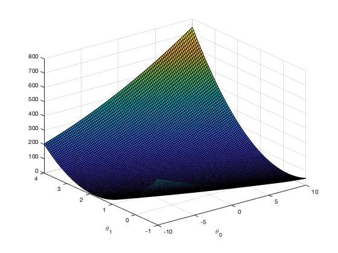

# Machine Learning (MATLAB)

Machine Learning course from Stanford University on Coursera.

## Linear Regression 

### Environment
- macOS Catalina (version 10.15.3)
- MATLAB 2018 b

### ==================== Part 1: Basic Function ====================
### warmUpExercise.m : Simple example function in MATLAB

```
function A = warmUpExercise()

# Return the 5x5 identity matrix 
A = eye(5);

end
```

### ===================== Part 2: Plotting =======================
### plotData.m : Function to display the dataset

```
function plotData(x, y)
figure;
plot(x,y,'rx', 'MarkerSize', 10);
xlabel("population of City in 10,000s");
ylabel("Profit in $10,000");
end
```


### =================== Part 3: Cost and Gradient descent ===================
In this part, we will fit the linear regression parameters θ to our dataset using gradient descent.


### computeCost.m : Function to compute the cost of linear regression
```
function J = computeCost(X, y, theta)

# Initialize some useful values
m = length(y); # number of training examples

# You need to return the following variables correctly 
J = 0;

# Compute the cost of a particular choice of theta. You should set J to the cost.
h = X * theta;
J = (1/(2 * m)) * sum((h-y).^2);
end
```

### gradientDescent.m : Function to run gradient descent
```
function [theta, J_history] = gradientDescent(X, y, theta, alpha, num_iters)

# Initialize some useful values
m = length(y); # number of training examples
J_history = zeros(num_iters, 1);

for iter = 1:num_iters
    
    h = X * theta;
    theta = theta - (alpha/m) * (X' * (h-y));
    
    % Save the cost J in every iteration    
    J_history(iter) = computeCost(X, y, theta);
end
end
```




### Result
Training data with Linear Regression Fit


## Course Links

1) Machine Learning by Stanford University on [Coursera](https://www.coursera.org/learn/machine-learning)

2) [Linear Regression](https://www.coursera.org/learn/machine-learning/programming/8f3qT/linear-regression) 
(Please notice that you need to log in to see the programming assignment.)